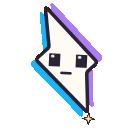
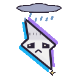
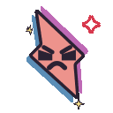
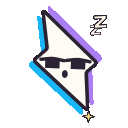
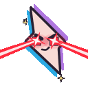
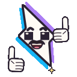
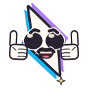

# Bolt, the Qwik mascot

The bolt from the Qwik logo, as a painted cartoon star and as an emoji set. Everything is made from code: the pictures
with [p5.js](https://p5js.org) and [p5.brush](https://github.com/acamposuribe/p5.brush), the film's music and sound
effects with plain Node. It builds on John Heibel's
[ClaudeAnimationBase](https://github.com/JohnHeibel/ClaudeAnimationBase) (MIT).

- **[JavaScript Streaming](#javascript-streaming)**: a 76-second explainer film of Qwik's JavaScript streaming.
- **[Emoji](#emoji)**: 15 emoji for the Qwik Discord, 14 of them animated.

Both share one kit (`src/core.js`, `src/clawd.js`, `src/bolt.js`, `render.mjs`; see [ANIMATION_GUIDE.md](ANIMATION_GUIDE.md)).
`src/bolt.js` has two face profiles: the emoji's big faces, which read at 22 px, and the film's smaller ones (pages pick
one with `window.BOLT_FACE`).

You need Node.js and Google Chrome; ffmpeg comes from the `ffmpeg-static` package. Run `npm install` first.

## JavaScript Streaming

A 76-second painted cartoon that explains Qwik's JavaScript streaming. It opens on a first visit to boltplush.shop
over a very slow network: the request rides off on a sleepy snail and the page stays blank. Then Bolt, the Qwik logo
with rubber-hose arms and legs, renders that page on the server and streams the HTML to the browser in pieces, the
slow part last. It then streams the page's JavaScript in the background over a slow network. When a click needs code
that hasn't arrived yet, Bolt's arm stretches all the way back down the line and sends that code first.

### Make the film

```bash
npm run video
```

`npm run video` builds the soundtrack, renders all 1,824 frames in headless Chrome (about 5 minutes on an M4 Pro) and
writes `out/qwik-javascript-streaming-1080p.mp4` and `out/qwik-javascript-streaming-720p.mp4`.

| command | what it does |
|---|---|
| `npm run audio` | builds the film's `assets/soundtrack.wav`, the intro and the full `assets/soundtrack_full.wav` from `audio/`, and checks them |
| `npm run frames` | renders every frame into `out/frames/` (resumable) |
| `npm run export` | encodes the frames and the soundtrack into the two MP4 files |
| `node render.mjs --sheet=12,12.5,13 --out=out/check/a.jpg` | a contact sheet of chosen times (see the top of `render.mjs` for strips, crops and stills) |

To scrub the film, open `studio.html` in Chrome (`studio.html?t=40` jumps to 40 s). The finished MP4s are attached to
the repo's [releases](https://github.com/maiieul/qwik-mascott/releases).

### What's here

| path | what it is |
|---|---|
| `STORYBOARD.md` | the film shot by shot, and what each picture means in Qwik terms |
| `RESEARCH.md` | how Qwik v2's streaming really works, with source references |
| `LIBRARY_SPEC.md`, `LIBRARY_API.md` | the world layout and the shared sets, props and cast |
| `RIG_API.md` | Bolt's rig: `qwik()` and its options |
| `src/scenes/` | the seven scene files |
| `src/lib/` | the shared library |
| `src/rig.js` | Bolt with rubber-hose limbs |
| `audio/` | the procedural soundtrack (see `audio/README.md`) |
| `render.mjs`, `tools/` | the renderer and the export |

## Emoji

The bolt from the Qwik logo as 15 emoji for the Qwik Discord, 14 of them animated.

<p>














</p>

### The files

`dist/` holds three files for each animated emoji, and a still SVG and PNG for the static one (`verynice`):

| file | what it is |
|---|---|
| `qwik_<name>.svg` | a still |
| `qwik_<name>_animated.svg` | the loop, animated with SMIL |
| `qwik_<name>_animated.gif` | the loop as a 128×128 GIF under 256 KB |
| `qwik_<name>.png` | a static emoji as a 128×128 PNG |

To add them to Discord, upload the GIFs and PNGs under Server Settings → Emoji. Discord names each emoji after its file,
so rename `qwik_happy_animated` to `qwik_happy` there. Only Nitro members can use animated emoji; everyone can use the
static one.

### Build

```bash
npm run build
```

`npm run build` draws every emoji into `out/svg/` and copies the files into `dist/`. `npm run check` draws them the
same way but only compares them with `dist/`, and fails if any file differs. Use it to prove a change leaves the art
alone.

| command | what it does |
|---|---|
| `node export_svg.mjs [name ...]` | writes the SVGs, for every emoji or the ones named |
| `node svg_to_gif.mjs [name ...]` | turns the animated SVGs into GIFs, and a static emoji's SVG into a PNG |
| `node pack.mjs [--check]` | copies `out/svg/` into `dist/`, or compares the two |
| `node check_face.mjs [name ...]` | shows how far each face part stays inside the bolt's outline |
| `npm run painted -- [name ...]` | writes GIFs and PNGs in the kit's watercolour look to `out/emoji/`, with `preview.png` on Discord's dark and light themes; `REUSE=1` skips the render and re-encodes the frames on disk |
| `npm run page` | writes one HTML page with every emoji's SVG to `out/site/` |

To scrub a loop, open `bolt.html?loop=emoji_happy` in Chrome, or `bolt.html?loop=boltEmotions` for every mood.

### What's here

| path | what it is |
|---|---|
| `src/bolt.js` | the bolt: shape, colours, face parts, sparks |
| `src/emoji.js` | the 15 emoji, and the `?clear` mode that renders on a transparent background |
| `src/svg_record.js` | records a frame's drawing calls as vector shapes |
| `src/bolt_sheets.js` | model sheets for the bolt |
| `bolt.html` | the studio page for the bolt |
| `export_svg.mjs`, `svg_to_gif.mjs`, `pack.mjs` | the build |
| `encode_emoji.mjs`, `render_bolt.mjs` | the watercolour GIFs |
| `gif_util.mjs` | GIF encoding for both |
| `build_page.mjs` | the HTML page |
| `check_face.mjs` | checks that the eyes, brows and mouths stay inside the bolt |
| the shared kit | see [ANIMATION_GUIDE.md](ANIMATION_GUIDE.md) |
